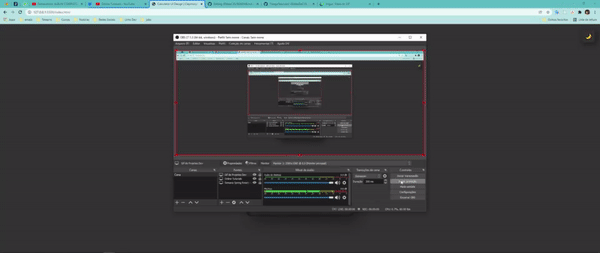
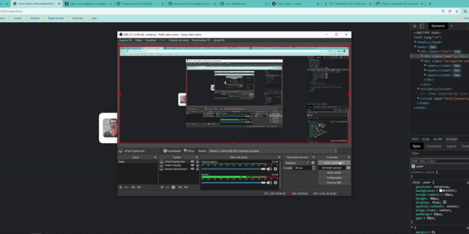
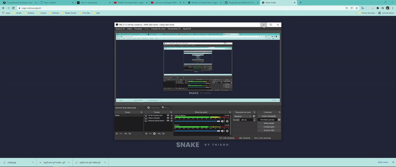
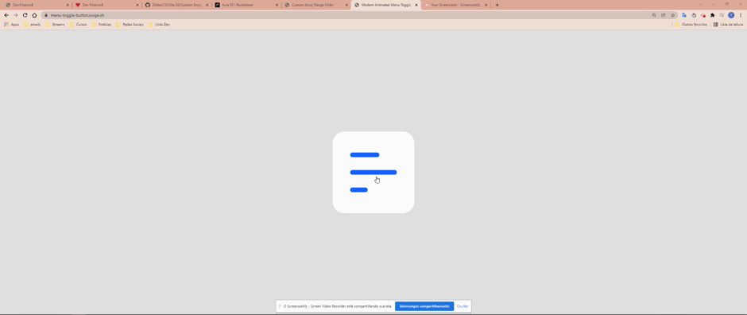
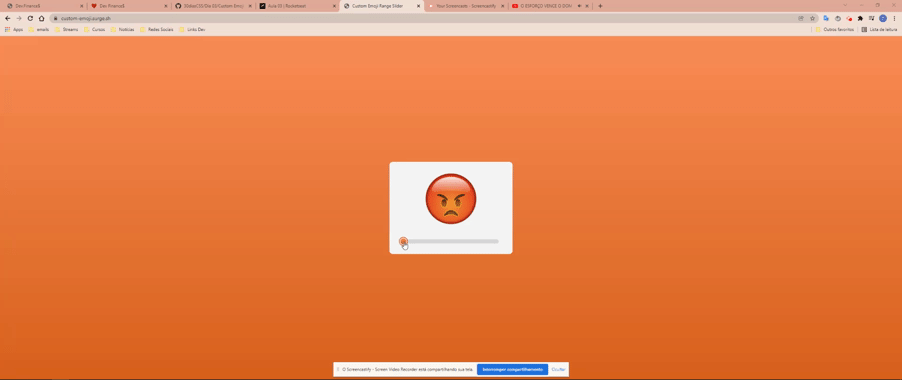

# 🚀 30diasDeCSS 🚀

  Bom dia/tarde/noite, tudo bom ?  
  
  30 dias de CSS3 é um desafio que visa melhorar minhas habilidades em HTML5 e CSS3 através da realização de mini projetos diários.
  Todos os créditos à [@MilenaCarecho](https://twitter.com/MilenaCarecho) 😄

 # Objetivo

  30 dias de CSS3 é um desafio que vou aceitar (e você também pode participar) a partir de 30 de Janeiro de 2022 (estou começando dia 28), que visa melhorar minhas habilidades em       HTML5 e CSS3 através da realização de projetos 
  
  # Regras gerais

  * Realizar um projeto por dia
  * Compartilhe seu progresso nas mídias sociais (Github && Linkedin) usando a hashtag #30diasDeCSS
  * O projeto deve ser concluído até 23:59

  # Regras pra mim 
  Vou aderir as regras tambem haha, mas vou fazer uma alteração, lembrando que não é obrigação, fique à vontade para fazer o mesmo, se quiser!

  * Se eu não concluir o projeto do dia, as 5 primeiras pessoas a apontar no Linkedin https://www.linkedin.com/in/thiago-tassinari-dev-front-end/ eu vou somar R$5 (total de R$25) numa quantia e ao final dos 30 dias irei doar toda essa quantia a uma instituição(a ser definida ainda).Adicionando um pouco de motivação para mim! 💸
  
  Gostou da ideia? 
  [Clique aqui](https://github.com/MilenaCarecho/30diasDeCSS/issues/1) para participar 
  
#### Youtube Referencias dos desafios
[Online Tutorials](https://www.youtube.com/channel/UCbwXnUipZsLfUckBPsC7Jog) - 
[Creative Creations](https://www.youtube.com/channel/UCOKmVksbzoKJKmtu7rlEM1A) - 
[DarkCode](https://www.youtube.com/channel/UCD3KVjbb7aq2OiOffuungzw)

#### Achei muito divertido ideia, e desafio todos que tenham interesse 🤗
#### Novamente, todos os créditos à criadora do desafio 👉 [@MilenaCarecho](https://twitter.com/MilenaCarecho) 👈

## Minhas redes sociais
 * [LinkedIn](https://www.linkedin.com/in/thiago-tassinari-dev-front-end/)
 * [GitHub](https://github.com/ThiagoTassinari)
  
### Vou atualizando aqui diariamente, qualquer dúvida estou a disposição 

* [Dia 01 - Calculadora](#id01)
* [Dia 02 - Action Menu Microinteractions](#id02)
* [Dia 02 - Game of the Snake](#id02)
* [Dia 03 - Modern Animated_Menu_Toggle](#id03)
* [Dia 03 - Custom_Emoji_Range_Slide](#id04)

##### Sites de referência

* *[MDN](https://developer.mozilla.org/en-US/)*
* *[CSS tricks](https://css-tricks.com/)*
* *[W3School](https://www.w3schools.com/)*

##  Desafio do dia 01 - Calculator UI Design - Claymorphism with Button Toggle to Dark | Light Mode 

<h2 align="center">
  
</h2>

##### O que eu aprendi

* *[CSS. Seletor de classe - w3school](https://www.w3schools.com/cssref/css_selectors.asp)*
* *[CSS. Translate()](https://developer.mozilla.org/en-US/docs/Web/CSS/transform-function/translate())*
* *[CSS. :nth-child()](https://developer.mozilla.org/en-US/docs/Web/CSS/:nth-child)*
* *[type="checkbox" in CSS](https://css-tricks.com/the-checkbox-hack/)*
* *[Js. Document.querySelector()](https://developer.mozilla.org/en-US/docs/Web/API/Document/querySelector)*

##  Desafios do dia 02 - Action Menu Microinteractions 

<h2 align="center">
  
</h2>

##### O que eu aprendi

* *[CSS. Seletor de classe](https://developer.mozilla.org/en-US/docs/Web/CSS/Class_selectors)*
* *[CSS. Translate()](https://developer.mozilla.org/en-US/docs/Web/CSS/transform-function/translate())*
* *[CSS. :nth-child()](https://developer.mozilla.org/en-US/docs/Web/CSS/:nth-child)*
* *[type="checkbox" in CSS](https://css-tricks.com/the-checkbox-hack/)*
* *[Js. Document.querySelector()](https://developer.mozilla.org/en-US/docs/Web/API/Document/querySelector)*

##  Desafios do dia 02 - Game of the Snake 

<h2 align="center">
  
</h2>

##### O que eu aprendi

* *[HTML. CanvasElement.getContext()](https://developer.mozilla.org/pt-BR/docs/Web/API/HTMLCanvasElement/getContext)*
* *[Métodos LocalStorage](https://developer.mozilla.org/pt-BR/docs/Web/API/Storage)*
* *[Js. addEventListener()](https://developer.mozilla.org/pt-BR/docs/Web/API/EventTarget/addEventListener)*
* *[Js. Object keys](https://developer.mozilla.org/pt-BR/docs/Web/JavaScript/Reference/Global_Objects/Object/keys)*
* *[DOM. Keydown](https://developer.mozilla.org/pt-BR/docs/Web/API/Document/keydown_event)*

##  Desafios do dia 03 - modern_animated_menu_toggle 

<h2 align="center">
  
</h2>

##### O que eu aprendi

* *[CSS. Transform](https://developer.mozilla.org/en-US/docs/Web/CSS/transform)*
* *[CSS. Transform origin](https://css-tricks.com/almanac/properties/t/transform-origin/)*
* *[Blog](https://danielcwilson.com/blog/2017/02/individual-transforms/)*
* *[CSS. @Support](https://developer.mozilla.org/en-US/docs/Web/CSS/@supports) *

##  Desafios do dia 03 - custom_emoji_range_slide 

<h2 align="center">
  
</h2>

##### O que eu aprendi

* *[CSS. Transform](https://developer.mozilla.org/en-US/docs/Web/CSS/transform)*
* *[CSS. Transform origin](https://css-tricks.com/almanac/properties/t/transform-origin/)*
* *[Blog](https://danielcwilson.com/blog/2017/02/individual-transforms/)*
* *[CSS. @Support](https://developer.mozilla.org/en-US/docs/Web/CSS/@supports) *
