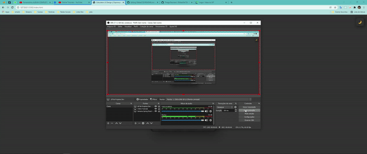

# 🚀 30diasDeCSS 🚀

  Bom dia/tarde/noite, tudo bom ?  
  
  30 dias de CSS3 é um desafio que visa melhorar minhas habilidades em HTML5 e CSS3 através da realização de mini projetos diários.
  Todos os créditos à [@MilenaCarecho](https://twitter.com/MilenaCarecho) 😄

 # Objetivo

  30 dias de CSS3 é um desafio que vou aceitar (e você também pode participar) a partir de 28 de Julho de 2022 (estou começando dia 28), que visa melhorar minhas habilidades em       HTML5 e CSS3 através da realização de projetos 
  
  # Regras gerais

  * Realizar um projeto por dia
  * Compartilhe seu progresso nas mídias sociais (Github && Linkedin) usando a hashtag #30diasDeCSS
  * O projeto deve ser concluído até 23:59

  # Regras pra mim 
  Vou aderir as regras tambem haha, mas vou fazer uma alteração, lembrando que não é obrigação, fique à vontade para fazer o mesmo, se quiser!

  * Se eu não concluir o projeto do dia, as 5 primeiras pessoas a apontar no Linkedin https://www.linkedin.com/in/thiago-tassinari-dev-front-end/ eu vou somar R$5 (total de R$25) numa quantia e ao final dos 30 dias irei doar toda essa quantia a uma instituição(a ser definida ainda).Adicionando um pouco de motivação para mim! 💸
  
  Gostou da ideia? 
  [Clique aqui](https://github.com/MilenaCarecho/30diasDeCSS/issues/1) para participar 
  
#### Youtube Referencias dos desafios
[Online Tutorials](https://www.youtube.com/channel/UCbwXnUipZsLfUckBPsC7Jog) - 
[Creative Creations](https://www.youtube.com/channel/UCOKmVksbzoKJKmtu7rlEM1A) - 
[DarkCode](https://www.youtube.com/channel/UCD3KVjbb7aq2OiOffuungzw)

#### Achei muito divertido ideia, e desafio todos que tenham interesse 🤗
#### Novamente, todos os créditos à criadora do desafio 👉 [@MilenaCarecho](https://twitter.com/MilenaCarecho) 👈

## Minhas redes sociais
 * [LinkedIn](https://www.linkedin.com/in/thiago-tassinari-dev-front-end/)
 * [GitHub](https://github.com/ThiagoTassinari)
  
### Vou atualizando aqui diariamente, qualquer dúvida estou a disposição 

* [Dia 01 - Calculadora](#id01)

##  Desafio dia 01 - Calculator UI Design - Claymorphism with Button Toggle to Dark | Light Mode 

<h2 align="center">
  
</h2>

##### O que eu aprendi

* *Criar as camadas utilizando a tag ``*
* *[CSS. Seletor de classe](https://www.w3schools.com/cssref/sel_class.asp)*
* *[Opacidade / transparência do CSS](https://www.w3schools.com/css/css_image_transparency.asp)*
* *[nth-child](https://www.w3schools.com/css/tryit.asp?filename=trycss_table_striped)*
* *[Box shadow](https://www.w3schools.com/cssref/css3_pr_box-shadow.asp)*
* *[Input types](https://www.w3schools.com/html/html_form_input_types.asp)*
* *[HTML Input Attributes](https://www.w3schools.com/html/html_form_attributes.asp)*
